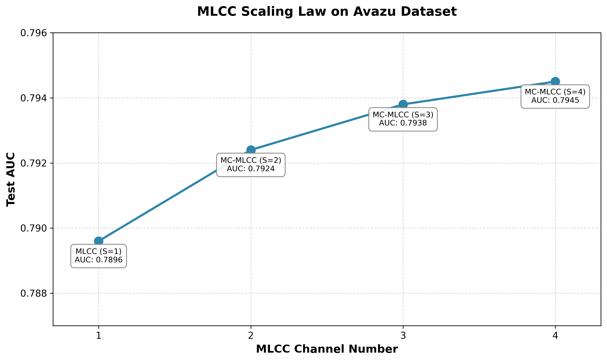

# Multi-Level Compression Cross Networks (MLCC)

Official MLCC implementation for the paper [**"Compress, Cross, and Scale: Multi-Level Compression Cross Networks for Efficient Scaling in Recommender Systems"**](https://arxiv.org/abs/2602.12041).

## Model Performance Comparison

### Main Model Performance

| Dataset | DNN (Baseline) | DCNv2 | Wukong | RankMixer | MLCC | MC-MLCC (S=4) |
|--------|-----------|-----|--------|-----------|------|---------------|
| **Criteo** | 0.7995 | 0.8012 | 0.8013 | 0.8008 | 0.8020 | **0.8034** |
| **Avazu** | 0.7844 | 0.7879 | 0.7893 | 0.7849 | 0.7896 | **0.7945** |
| **TaobaoAds** | 0.6544 | 0.6556 | 0.6568 | 0.6555 | 0.6588 | **0.6596** |

*Note: All metrics are test AUC*

### MLCC Architecture AUC Improvement

| Dataset | Baseline AUC | MLCC vs Baseline | MC-MLCC (S=4) vs Baseline | Best Gain |
|--------|---------|-------------|---------------------|---------|
| **Criteo** | 0.7995 | +0.0025 (+0.31%) | +0.0039 (+0.49%) | **+0.49%** |
| **Avazu** | 0.7844 | +0.0052 (+0.66%) | +0.0101 (+1.29%) | **+1.29%** |
| **TaobaoAds** | 0.6544 | +0.0044 (+0.67%) | +0.0052 (+0.79%) | **+0.79%** |

**Key Findings:**
- MC-MLCC (S=4) achieves the best performance on all datasets
- MLCC shows clear scaling law behavior, with performance improving as layers increase
- Avazu dataset shows the largest gain (+1.29%), validating MLCC's effectiveness in sparse feature scenarios



**For full results and analysis, see**:
- [Criteo Dataset Experiment Report](docs/exp_criteo.md)
- [Avazu Dataset Experiment Report](docs/exp_avazu.md)
- [TaobaoAds Dataset Experiment Report](docs/exp_taobaoads.md)

## 🚀 Quick Start

### Basic Usage
```bash
# 1. Install dependencies
pip install -r requirements.txt

# 2. Prepare data (e.g. Criteo dataset)
bash scripts/prepare_criteo.sh data/raw/criteo/train.txt data/raw/criteo

# 3. Train model
python scripts/train.py --config configs/dnn_criteo/dnn.yaml
```

**For detailed instructions, see**: [Quick Start Guide](docs/quick_start.md)

## Core Components

- **models/**: Model implementations (DNN, DCNv2, Wukong, RankMixer, MLCC)
- **trainers/**: Trainer and evaluation logic (CTRTrainer)
- **datasets/**: Dataset classes (Criteo, Avazu, TaobaoAds) + Unified feature ID processor (FeatureIDProcessor)
- **utils/**: Utility functions (config loading, data loaders, model analysis)
  - `model_analysis.py`: Model parameter, memory, and FLOPs analysis tool
- **configs/**: YAML config files
- **scripts/**: Training, evaluation, and data preprocessing scripts

## 📚 Documentation

- **[Quick Start Guide](docs/quick_start.md)**: Detailed installation, training, and evaluation tutorial
- **[Technical Details and Extensions](docs/misc.md)**: Performance optimization, feature ID architecture, and development guide

## 🛠 Development

- **Add new model**: Inherit from `torch.nn.Module` and implement in `models/` directory
- **Add new dataset**: Inherit from `BaseCTRDataset` and implement `FeatureIDProcessor` logic
- **Add new metric**: Extend evaluation metrics in `trainers/metrics.py`

